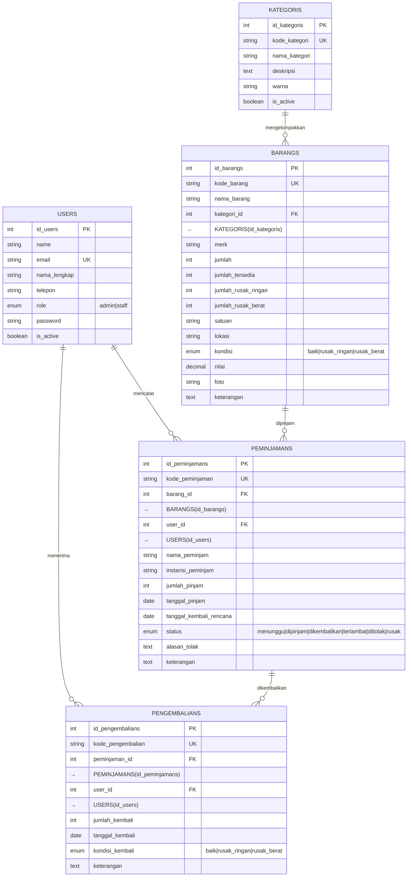
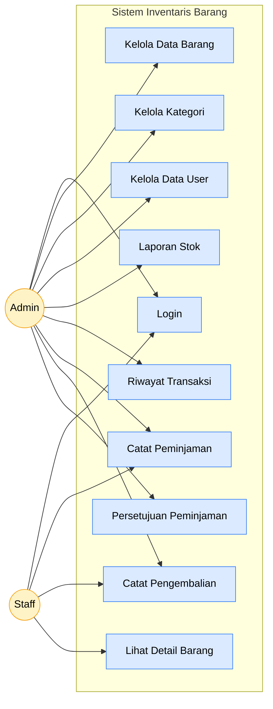
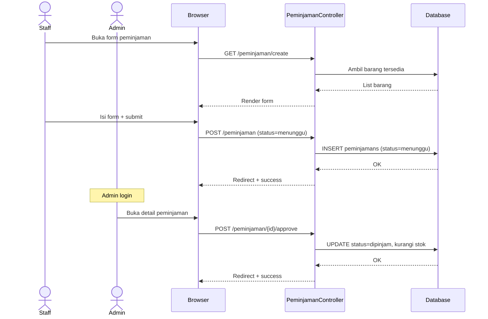
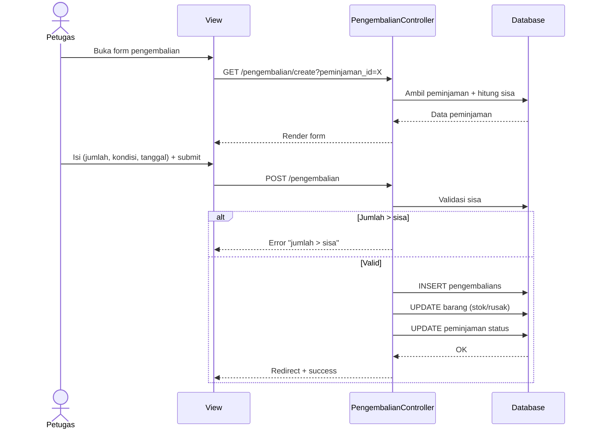
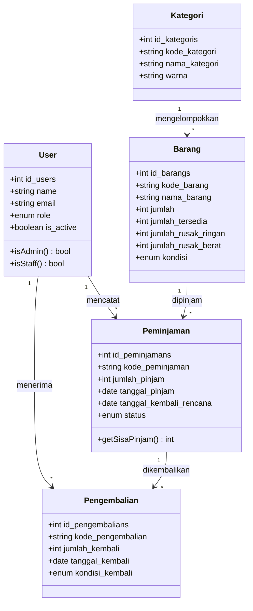

# ERD & Diagram UML — Sistem Inventaris Barang

> Dokumen diagram untuk revisi skripsi.
> Catatan dosen: "ERD — primary key, atribut, penyederhanaan diagram, entitas pengembalian."

---

## 1. Entity Relationship Diagram (ERD)

### ERD Sederhana (Perbaikan dari catatan dosen — minimal, hanya atribut penting)

### Catatan Penting ERD

1. **Primary key (id)**: tiap entitas punya PK auto-increment
2. **Unique key**: `kode_barang`, `kode_peminjaman`, `kode_pengembalian`, `kode_kategori`, `email`
3. **Foreign key** dengan `onDelete('restrict')` agar data historis tidak hilang
4. **Refactor pengembalian**: dipisah jadi entitas sendiri (catatan dosen) supaya bisa **pengembalian parsial** (pinjam 5, kembali 2 dulu)

---

## 2. Use Case Diagram

---

## 3. Activity Diagram — Alur Peminjaman

---

## 4. Activity Diagram — Alur Pengembalian

---

## 5. Sequence Diagram — Peminjaman (Staff → Admin)

---

## 6. Sequence Diagram — Pengembalian

---

## 7. Class Diagram

---

## 8. Penomoran Catatan Dosen & Jawaban

| Catatan Dosen | Status | Keterangan |
|---|---|---|
| "Req non-FS" → **Req non-Fungsional** | ✅ | Sudah ada di BAB 4 (performa, keamanan, usabilitas) |
| "A.K.F. user" → **Aktor / Kebutuhan Fungsional user** | ✅ | Tersedia use case di Section 2 |
| Admin: login, kelola barang, kategori, persediaan, user, laporan, riwayat | ✅ | Sudah implemented |
| Staff: login, pinjam, kembali, detail, persetujuan | ✅ | Sudah implemented (admin only untuk approve) |
| ERD: PK, atribut, penyederhanaan | ✅ | Section 1 — ERD sederhana + atribut lengkap |
| ERD: entitas pengembalian | ✅ | **Refactor: entitas `pengembalians` terpisah** (migration baru) |
| Diagram loom → use case, activity, sequence | ✅ | Section 2-6 (Mermaid) |
| Boundary X actor (UML) | ✅ | Use case menampilkan actor & boundary system |

---

*Dokumen ini bisa langsung di-convert ke PDF via [mermaid.live](https://mermaid.live) atau plugin Obsidian/VSCode.*
