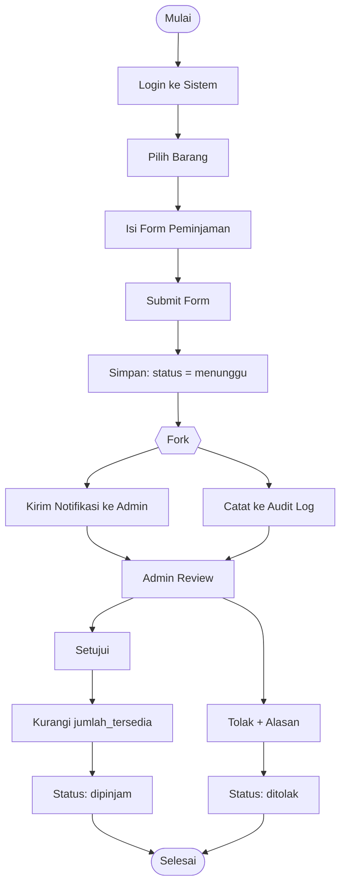
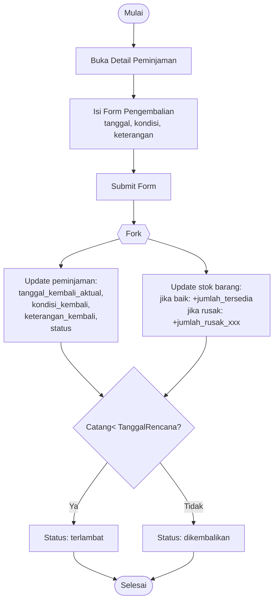
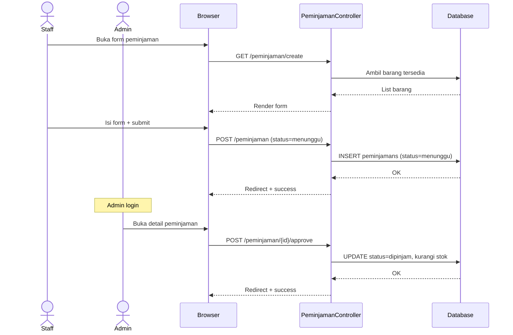
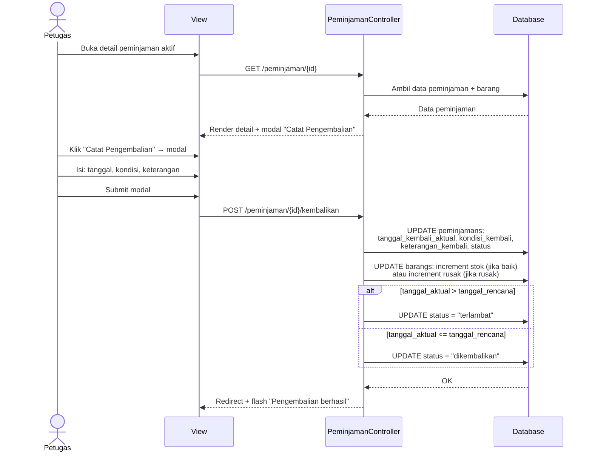
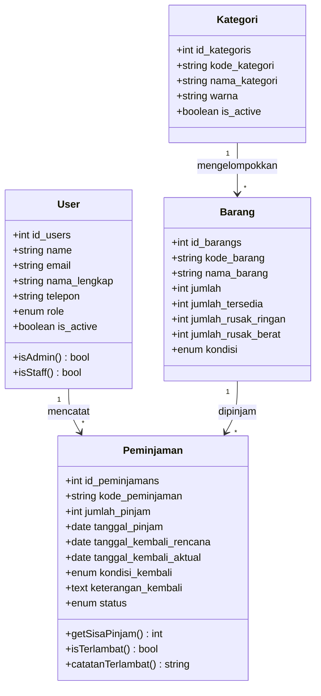

# ERD & Diagram UML — Sistem Inventaris Barang

> Dokumen diagram untuk revisi skripsi.
>
> **Catatan dosen**: "ERD — primary key, atribut, penyederhanaan diagram, entitas pengembalian."
>
> **Catatan dosen tambahan (sidang)**: usecase fish level, activity tanpa decision (pakai fork), sequence sesuai teori, ERD/LRS redundancy kode_kategori + password.
>
> **Update 2026-08-26 (v3):** entitas pengembalian dikembalikan (revert ke field inline di peminjamans) atas permintaan user. Skenario disederhanakan jadi full-return only — tanpa partial return, tanpa history multi-event.

---

## 1. Entity Relationship Diagram (ERD)

> **Catatan dosen**: primary key per entitas, atribut seminimal mungkin, penyederhanaan diagram.

### ERD Sederhana

```mermaid
erDiagram
    USERS ||--o{ PEMINJAMANS : "mencatat"
    KATEGORIS ||--o{ BARANGS : "mengelompokkan"
    BARANGS ||--o{ PEMINJAMANS : "dipinjam"

    USERS {
        int id_users PK
        string name
        string email UK
        string nama_lengkap
        string telepon
        enum role "admin|staff"
        string password
        boolean is_active
    }

    KATEGORIS {
        int id_kategoris PK
        string kode_kategori UK
        string nama_kategori
        text deskripsi
        string warna
        boolean is_active
    }

    BARANGS {
        int id_barangs PK
        string kode_barang UK
        string nama_barang
        int kategori_id FK "→ KATEGORIS(id_kategoris)"
        string merk
        int jumlah
        int jumlah_tersedia
        int jumlah_rusak_ringan
        int jumlah_rusak_berat
        string satuan
        string lokasi
        enum kondisi "baik|rusak_ringan|rusak_berat"
        decimal nilai
        string foto
        text keterangan
    }

    PEMINJAMANS {
        int id_peminjamans PK
        string kode_peminjaman UK
        int barang_id FK "→ BARANGS(id_barangs)"
        int user_id FK "→ USERS(id_users)"
        string nama_peminjam
        string instansi_peminjam
        int jumlah_pinjam
        date tanggal_pinjam
        date tanggal_kembali_rencana
        date tanggal_kembali_aktual nullable
        enum kondisi_kembali "baik|rusak_ringan|rusak_berat" nullable
        text keterangan_kembali nullable
        enum status "menunggu|dipinjam|dikembalikan|terlambat|ditolak"
    }
```

### Catatan Penting ERD

1. **Primary key (id)**: tiap entitas punya PK auto-increment
2. **Unique key**: `kode_barang`, `kode_peminjaman`, `kode_kategori`, `email`
3. **Foreign key** dengan `onDelete('restrict')` agar data historis tidak hilang
4. **Pengembalian**: field `tanggal_kembali_aktual`, `kondisi_kembali`, `keterangan_kembali`
   disimpan langsung di tabel `peminjamans` (simplifikasi — full return only)
5. **Redundancy audit**:
   - `kode_kategori` di tabel `kategoris`: business code (ELK/FRN/LAB), bukan duplikat.
     Bisa dihapus jika `id_kategoris` dianggap cukup sebagai identifier. PK `id_kategoris`
     sudah cukup sebagai referensi; `kode_kategori` dipertahankan sebagai kode bisnis
     yang mudah dibaca manusia.
   - `password` di tabel `users`: hanya ada di 1 tempat, di-hash dengan bcrypt.
     Tidak ada duplikat di tabel lain. Laravel `Hash::make()` diterapkan.

---

## 2. Use Case Diagram

```mermaid
%% ─────────────────────────────────────────────────────────────────
%% Use Case Diagram — Fish Level (Level 0)
%% SISTEM sebagai 1 kotak besar, aktor di LUAR, usecase di DALAM.
%% TIDAK ADA relasi <<include>>/<<extend>> di level ini (baru di Level 1).
%% Ref: Bruegge & Dutoit, "Object-Oriented Software Engineering
%% Using UML, Patterns, and Java" — Use Case level bertingkat.
%% ─────────────────────────────────────────────────────────────────
flowchart LR
    classDef actor fill:#fef3c7,stroke:#f59e0b,color:#000
    classDef usecase fill:#dbeafe,stroke:#3b82f6,color:#000

    Admin((Admin)):::actor
    Staff((Staff)):::actor

    subgraph Sistem["Sistem Inventaris Barang"]
        UC1[Login]:::usecase
        UC2[Kelola Data Barang]:::usecase
        UC3[Kelola Kategori]:::usecase
        UC4[Kelola Data User]:::usecase
        UC5[Laporan Stok]:::usecase
        UC6[Riwayat Peminjaman]:::usecase
        UC7[Catat Peminjaman]:::usecase
        UC8[Catat Pengembalian<br/><i>(inline di detail)</i>]:::usecase
        UC9[Lihat Detail Barang]:::usecase
        UC10[Persetujuan Peminjaman]:::usecase
        UC11[Cetak Laporan]:::usecase
        UC12[Reset Password User]:::usecase
    end

    Admin --> UC1
    Admin --> UC2
    Admin --> UC3
    Admin --> UC4
    Admin --> UC5
    Admin --> UC6
    Admin --> UC7
    Admin --> UC8
    Admin --> UC10
    Admin --> UC11
    Admin --> UC12

    Staff --> UC1
    Staff --> UC2
    Staff --> UC5
    Staff --> UC6
    Staff --> UC7
    Staff --> UC8
    Staff --> UC9
    Staff --> UC11
```

---

## 3. Activity Diagram — Alur Peminjaman

> **Catatan revisi dosen**: hapus decision symbol (◇) pada alur CRUD —
> di alur ini tidak ada percabangan validasi bercabang yang perlu decision.
> Gunakan **fork node** untuk percabangan paralel (alur yang **HARUS
> terjadi bersamaan**, bukan kondisional).
> Ref: Fowler (2004), *UML Distilled* (ed. 3), hal. 95-100.



**Penjelasan simbol**:
- `Login`, `PilihBarang`, `IsiForm` = activity node (rounded rectangle)
- `Fork` = garis horizontal tebal — memecah alur jadi paralel
- `[Selesai]` = final node (lingkaran terisi)
- **TIDAK ADA** decision symbol (`{...}`) di activity ini karena
  percabangan Admin (setuju/tolak) bukan kondisi logika program,
  melainkan keputusan manual yang dilakukan manusia

---

## 4. Activity Diagram — Alur Pengembalian

> **Catatan revisi dosen**: pada activity diagram pengembalian, terlalu banyak
> symbol decision tanpa pengujian. Pengembalian di sistem ini adalah
> **full return** (satu kali, semua barang dikembalikan sekaligus), bukan
> partial return. Alur tidak memiliki percabangan kondisional bercabang —
> fork node digunakan untuk alur paralel (simpan + update stok).



**Perubahan dari versi sebelumnya**:
- Decision symbol dikurangi dari 4 menjadi 1 (hanya untuk cek terlambat/tepat waktu)
- Fork node untuk alur paralel: simpan data + update stok berjalan bersamaan
- Field pengembalian (`tanggal_kembali_aktual`, `kondisi_kembali`, `keterangan_kembali`)
  disimpan langsung di tabel `peminjamans` (inline, bukan entitas terpisah)

---

## 5. Logical Record Structure (LRS)

> **Catatan dosen**: ERD dan LRS terdapat redundancy data kode_kategori dan password.
> LRS menunjukkan struktur logis record per entitas dengan notasi:
> `NAMA_FILE(JenisFile, Key, Data, Link)`
> - JenisFile: K (Cluster/Parent), I (Index/Child)
> - Key: Primary Key (PK), Alternate Key (AK), Foreign Key (FK)

```
┌─────────────────────────────────────────────────────────────────┐
│ KATEGORIS (K, PK=id_kategoris, AK=kode_kategori)               │
│   id_kategoris          : Integer (PK, Auto Increment)          │
│   kode_kategori         : Varchar(10) (AK, UNIQUE, nullable)   │
│   nama_kategori         : Varchar(100)                        │
│   deskripsi             : Text                                 │
│   warna                 : Varchar(20)                          │
│   is_active             : Boolean                              │
│   Link: → BARANGS(kategori_id)                                 │
└─────────────────────────────────────────────────────────────────┘
                              │
                              │ 1:N
                              ▼
┌─────────────────────────────────────────────────────────────────┐
│ BARANGS (I, PK=id_barangs, AK=kode_barang, FK=kategori_id)    │
│   id_barangs            : Integer (PK, Auto Increment)         │
│   kode_barang           : Varchar(30) (AK, UNIQUE)            │
│   nama_barang           : Varchar(200)                        │
│   kategori_id            : Integer (FK → KATEGORIS)             │
│   merk                  : Varchar(100)                        │
│   jumlah                : Integer                              │
│   jumlah_tersedia       : Integer                              │
│   jumlah_rusak_ringan   : Integer                              │
│   jumlah_rusak_berat    : Integer                              │
│   satuan                : Varchar(20)                          │
│   lokasi                : Varchar(100)                         │
│   kondisi                : Enum(baik|rusak_ringan|rusak_berat) │
│   nilai                 : Decimal                              │
│   foto                  : Varchar(255)                         │
│   keterangan            : Text                                 │
│   Link: → PEMINJAMANS(barang_id)                               │
└─────────────────────────────────────────────────────────────────┘
                              │
                              │ 1:N
                              ▼
┌─────────────────────────────────────────────────────────────────┐
│ PEMINJAMANS (I, PK=id_peminjamans, AK=kode_peminjaman,         │
│              FK=barang_id, FK=user_id)                         │
│   id_peminjamans        : Integer (PK, Auto Increment)         │
│   kode_peminjaman       : Varchar(20) (AK, UNIQUE)            │
│   barang_id             : Integer (FK → BARANGS)               │
│   user_id               : Integer (FK → USERS)                │
│   nama_peminjam         : Varchar(200)                         │
│   instansi_peminjam     : Varchar(200)                         │
│   jumlah_pinjam         : Integer                              │
│   tanggal_pinjam         : Date                                 │
│   tanggal_kembali_rencana: Date                                 │
│   tanggal_kembali_aktual : Date (nullable, nullable)            │
│   kondisi_kembali        : Enum(baik|rusak_ringan|rusak_berat)  │
│   keterangan_kembali     : Text (nullable)                     │
│   status                : Enum(menunggu|dipinjam|dikembalikan  │
│                              |terlambat|ditolak)               │
│   Link: → USERS(user_id)                                       │
└─────────────────────────────────────────────────────────────────┘

┌─────────────────────────────────────────────────────────────────┐
│ USERS (K, PK=id_users, AK=email, FK=None)                     │
│   id_users              : Integer (PK, Auto Increment)         │
│   name                  : Varchar(50)                          │
│   email                 : Varchar(255) (AK, UNIQUE)            │
│   nama_lengkap           : Varchar(200)                         │
│   telepon               : Varchar(20) (nullable)               │
│   role                  : Enum(admin|staff)                   │
│   password               : Varchar(255) (hashed bcrypt)        │
│   is_active             : Boolean                              │
│   Link: → PEMINJAMANS(user_id)                                 │
└─────────────────────────────────────────────────────────────────┘
```

**Analisis Redundancy (sesuai catatan dosen)**:

| Entitas | Atribut | Redundancy? | Penjelasan |
|---|---|---|---|
| KATEGORIS | `kode_kategori` | ⚠️ Potensial | Business code (ELK/FRN/LAB). `id_kategoris` sudah cukup sebagai PK. Kode disimpan agar mudah dibaca manusia di UI, bukan duplikat data. |
| USERS | `password` | ✅ Tidak ada | Hanya ada di tabel `users`. Di-hash dengan bcrypt. Tidak ada salinan di tabel lain. |

---

## 6. Sequence Diagram — Peminjaman (Staff → Admin)



---

## 7. Sequence Diagram — Pengembalian

> Flow baru (v3): pengembalian dicatat inline dari detail peminjaman.
> Tidak ada halaman terpisah. Field langsung di-update di tabel `peminjamans`.



---

## 8. Class Diagram



**Catatan**: setelah revert ke flow simple, class `Pengembalian` dihapus.
Informasi pengembalian disimpan langsung di atribut `Peminjaman`
(`tanggal_kembali_aktual`, `kondisi_kembali`, `keterangan_kembali`).

---

## 9. Penomoran Catatan Dosen & Jawaban

| Catatan Dosen | Status | Keterangan |
|---|---|---|
| "Req non-FS" → **Req non-Fungsional** | ✅ | Sudah ada di BAB 4 |
| "A.K.F. user" → **Aktor / Kebutuhan Fungsional user** | ✅ | Use case di Section 2 |
| Admin: login, kelola barang, kategori, persediaan, user, laporan, riwayat | ✅ | Semua implemented |
| Staff: login, pinjam, kembali, detail, persetujuan | ✅ | Sudah implemented |
| ERD: PK, atribut, penyederhanaan | ✅ | Section 1 |
| ERD: entitas pengembalian | ✅→⚠️ | Semula terpisah (v2), revert ke field inline di peminjamans (v3) |
| Diagram → use case, activity, sequence, class | ✅ | Section 2-8 (Mermaid) |
| Boundary X actor (UML) | ✅ | Use case menampilkan actor & boundary system |
| Use case **fish level (Level 0)** | ✅ | Section 2, tanpa relasi <<include>>/<<extend>> |
| Activity: hapus decision, pakai **fork node** | ✅ | Section 3-4, fork untuk alur paralel |
| Sequence sesuai teori (tanpa decision symbol berlebih) | ✅ | Section 6-7 |
| ERD + LRS redundancy: **kode_kategori + password** | ✅ | Audit di Section 1 (kode_kategori = business code, tidak redundancy); password = 1 tempat, bcrypt |
| Component diagram pakai **tools UML** | ⚠️ | Perlu dibuat ulang dengan StarUML / Visual Paradigm / draw.io |

---

## 10. Component Diagram

> **Catatan dosen**: component diagram harus menggunakan tools UML yang benar
> (StarUML, Visual Paradigm, Lucidchart, atau draw.io dengan shape UML).
> Bukan tool flowchart biasa.

**Komponen utama sistem**:

```
┌──────────────────────────────────────────────────────────────────────┐
│                    Sistem Inventaris Barang                           │
│                                                                      │
│  ┌─────────────────┐  ┌──────────────────┐  ┌───────────────────┐   │
│  │ Presentation    │  │ Business Logic   │  │ Data Access      │   │
│  │ Layer           │  │ Layer            │  │ Layer (DAL)     │   │
│  ├─────────────────┤  ├──────────────────┤  ├───────────────────┤   │
│  │ • View          │  │ • Controller     │  │ • Eloquent ORM   │   │
│  │   (Blade)      │  │   (Controller)   │  │ • Model          │   │
│  │ • Component    │  │ • FormRequest    │  │ • Migration      │   │
│  │   (x-sort)     │  │ • Middleware     │  │                  │   │
│  │ • Layout       │  │ • Service        │  │                  │   │
│  └───────┬─────────┘  └────────┬─────────┘  └────────┬──────────┘   │
│          │                     │                      │              │
│          └─────────────────────┼──────────────────────┘              │
│                                │                                     │
│                     ┌──────────▼──────────┐                        │
│                     │   MySQL Database     │                        │
│                     │  ┌───────────────┐  │                        │
│                     │  │ users         │  │                        │
│                     │  │ kategoris     │  │                        │
│                     │  │ barangs       │  │                        │
│                     │  │ peminjamans   │  │                        │
│                     │  └───────────────┘  │                        │
│                     └─────────────────────┘                        │
│                                                                      │
│  ┌──────────────────────────────────────────────────────────────┐    │
│  │ External Interfaces                                          │    │
│  │  • Web Browser (Chrome/Firefox/Edge)                       │    │
│  │  • HTTP/HTTPS (Apache/Nginx)                                │    │
│  │  • PHP 8.3+ Runtime (Laravel 11)                            │    │
│  └──────────────────────────────────────────────────────────────┘    │
└──────────────────────────────────────────────────────────────────────┘
```

**Tools yang digunakan**:
- **Laravel 11** — backend framework (PHP 8.3)
- **Blade Template** — frontend rendering
- **MySQL** — relational database
- **Mermaid** — diagram rendering (untuk dokumentasi skripsi)
- **ZenUML** — sequence diagram notation (zenuml.com)

---

## 11. ZenUML Sequence Diagram (Lanjutan)

> **ZenUML** = notasi sequence ringkas, fokus alur antar objek.
> Cocok untuk skripsi karena lebih ringkas dari Mermaid sequenceDiagram.
> Preview: buka [zenuml.com](https://zenuml.com) → paste code → klik Render.

### 11.1. Alur Peminjaman (Staff → Admin ACC)

```zenuml
title Peminjaman Barang (Full Flow)

Staff -> PeminjamanController : GET /peminjaman/create
PeminjamanController -> Barang : where(jumlah_tersedia > 0)
Barang --> PeminjamanController : list barang
PeminjamanController --> Staff : form peminjaman

Staff -> PeminjamanController : POST /peminjaman
PeminjamanController -> PeminjamanRequest : validate()
if valid {
  PeminjamanController -> Peminjaman : create(status=menunggu)
  PeminjamanController --> Staff : flash "Menunggu persetujuan"
} else {
  PeminjamanRequest --> PeminjamanController : 422 Unprocessable
  PeminjamanController --> Staff : back() + errors
}

Admin -> PeminjamanController : GET /peminjaman/{id}
PeminjamanController -> Peminjaman : findOrFail
PeminjamanController --> Admin : detail view

Admin -> PeminjamanController : POST /peminjaman/{id}/approve
if status == menunggu {
  PeminjamanController -> Peminjaman : update(status=dipinjam)
  PeminjamanController -> Barang : decrement jumlah_tersedia
  PeminjamanController --> Admin : flash "Disetujui"
} else {
  PeminjamanController --> Admin : flash "Tidak dapat diubah"
}

Admin -> PeminjamanController : POST /peminjaman/{id}/reject
PeminjamanController -> Peminjaman : update(status=ditolak, alasan_tolak)
PeminjamanController --> Admin : flash "Ditolak"
```

### 11.2. Alur Pengembalian (Inline di Detail)

```zenuml
title Pengembalian Barang (Inline di Detail)

Petugas -> PeminjamanController : GET /peminjaman/{id}
PeminjamanController -> Peminjaman : findOrFail(id)
PeminjamanController --> Petugas : detail view + modal

Petugas -> PeminjamanController : POST /peminjaman/{id}/kembalikan
PeminjamanController -> PengembalianRequest : validate(
  tanggal_kembali, kondisi_kembali, keterangan_kembali
)
if valid {
  PengembalianRequest --> PeminjamanController : validated data
  PeminjamanController -> Peminjaman : update(
    tanggal_kembali_aktual,
    kondisi_kembali,
    keterangan_kembali,
    status
  )
  if kondisi == rusak_ringan {
    PeminjamanController -> Barang : increment jumlah_rusak_ringan
    PeminjamanController -> Barang : decrement jumlah_tersedia
  }
  if kondisi == rusak_berat {
    PeminjamanController -> Barang : increment jumlah_rusak_berat
    PeminjamanController -> Barang : decrement jumlah_tersedia
  }
  if kondisi == baik {
    PeminjamanController -> Barang : increment jumlah_tersedia
  }
  if tanggal_aktual > tanggal_rencana {
    PeminjamanController -> Peminjaman : update(status=terlambat)
  } else {
    PeminjamanController -> Peminjaman : update(status=dikembalikan)
  }
  PeminjamanController --> Petugas : redirect + flash "Berhasil"
} else {
  PengembalianRequest --> PeminjamanController : 422
  PeminjamanController --> Petugas : back() + errors
}
```

### 11.3. Laporan + Sort + Filter

```zenuml
title Laporan (Filter + Sort + Export)

User -> LaporanController : GET /laporan/stok?kategori=1&sort=nama_barang&direction=asc
LaporanController -> Barang : with(kategori).where(kategori_id, 1).orderBy(nama_barang, asc)
LaporanController --> User : tabel stok + filter aktif

User -> LaporanController : GET /laporan/riwayat?status=terlambat&sort=tanggal_pinjam&direction=desc
LaporanController -> Peminjaman : with(barang,user).where(status,terlambat)
LaporanController --> User : tabel riwayat + badge terlambat

User -> LaporanController : GET /laporan/export/excel/stok?{filters}
LaporanController -> BarangExport : new BarangExport(filters)
BarangExport --> User : .xlsx download
```

### 11.4. Perbandingan Mermaid vs ZenUML

| Aspek | Mermaid | ZenUML |
|---|---|---|
| Sintaks | Verbose | Ringkas |
| Branch | `alt/else/end` | `if/else {}` (native) |
| Activate | Manual | Auto |
| Sequence detail | Biasa | Lebih ringkas |
| ERD / Activity | ✅ Terbaik | ❌ Tidak support |
| Cocok untuk | Dokumentasi tim | Skripsi / akademis |

**Rekomendasi skripsi**: pakai **ZenUML** untuk sequence (bagian 11), **Mermaid** untuk ERD + activity + class (bagian 1-8). Jangan duplicate alur yang sama di dua notasi.

---

## 12. Format PDF Laporan

Template: `resources/views/laporan/pdf/{stok_barang,riwayat_peminjaman}.blade.php` (Landscape A4, header logo, footer page number, sort + filter dari query string).

---

## 13. Daftar Pustaka (APA Style, 7th ed.)

> **Catatan dosen**: kutipan harus menggunakan APA Style.
> Format: `Author, A. A. (Year). *Title*. Publisher. https://doi.org/...`

### Buku Referensi UML & Pemodelan

Bruegge, B., & Dutoit, A. H. (2010). *Object-oriented software engineering using UML, patterns, and Java* (3rd ed.). Pearson Prentice Hall.

Fowler, M. (2004). *UML distilled: A brief guide to the standard object modeling language* (3rd ed.). Addison-Wesley.

Rumbaugh, J., Jacobson, I., & Booch, G. (2005). *The unified modeling language reference manual* (2nd ed.). Addison-Wesley.

Booch, G., Rumbaugh, J., & Jacobson, I. (2005). *The unified software development process* (2nd ed.). Addison-Wesley.

### Database & ERD

Connolly, T. M., & Begg, C. E. (2015). *Database systems: A practical approach to design, implementation, and management* (6th ed.). Pearson.

Elmasri, R., & Navathe, S. B. (2016). *Fundamentals of database systems* (7th ed.). Pearson.

Date, C. J. (2003). *An introduction to database systems* (8th ed.). Pearson Addison-Wesley.

### Web Development & Laravel

Stauffer, M. (2019). *Laravel: Up & running: A framework for building modern PHP apps* (2nd ed.). O'Reilly Media.

Szklanowski, L. (2018). *Modern PHP: New features and good practices*. O'Reilly Media.

### Metodologi & Software Engineering

Sommerville, I. (2015). *Software engineering* (10th ed.). Pearson.

Pressman, R. S., & Maxim, B. R. (2015). *Software engineering: A practitioner's approach* (8th ed.). McGraw-Hill Education.

---

*Sitasi yang digunakan di dokumen ini:*
- *Bruegge & Dutoit (2010) — Use Case level bertingkat*
- *Fowler (2004) — Activity diagram: decision vs fork node*

*Dokumen ini bisa langsung di-convert ke PDF via [mermaid.live](https://mermaid.live) atau plugin Obsidian/VSCode. ZenUML: buka [zenuml.com](https://zenuml.com) → paste code → Render.*
