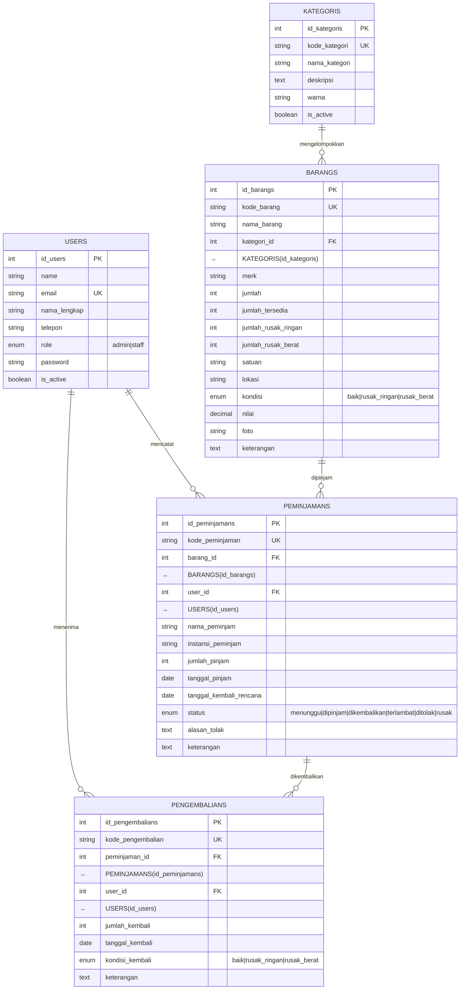
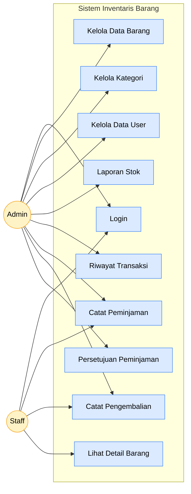
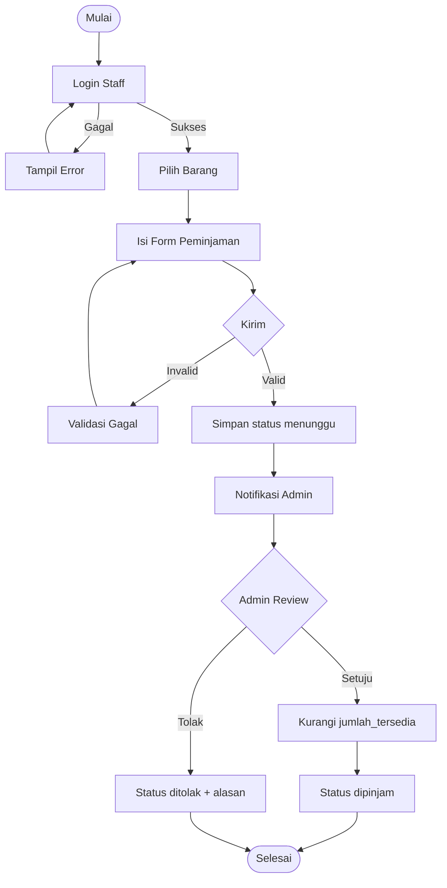
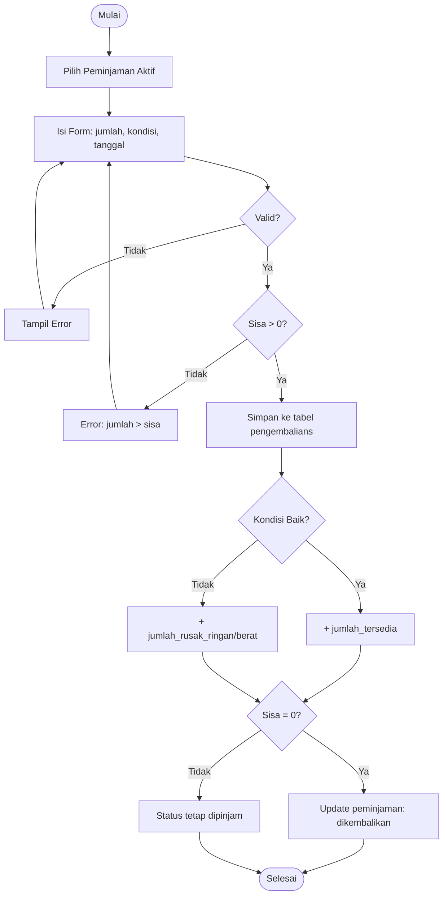
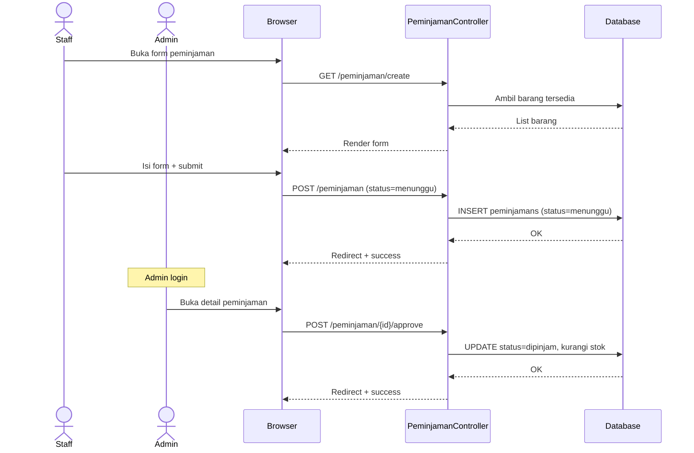
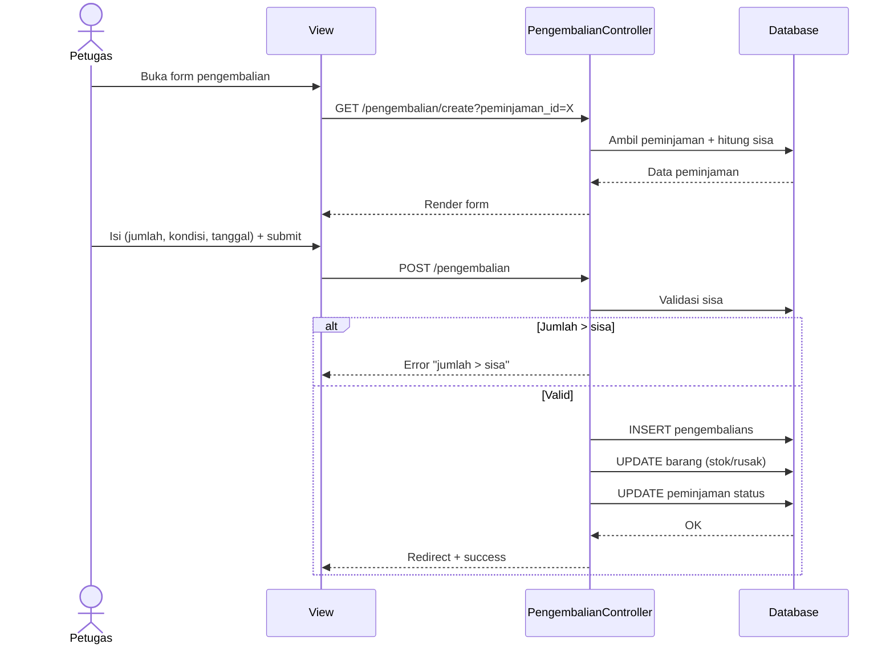
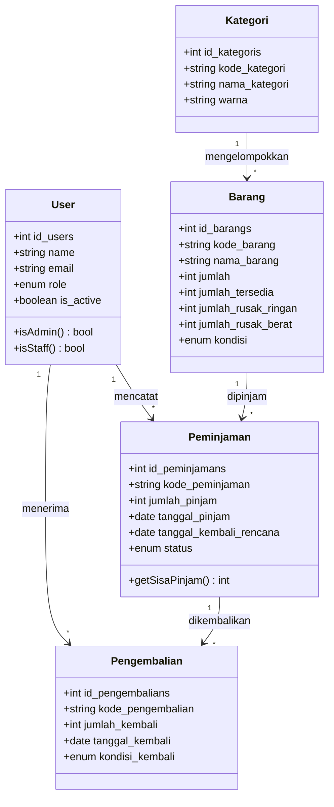

# ERD & Diagram UML — Sistem Inventaris Barang

> Dokumen diagram untuk revisi skripsi.
> Catatan dosen: "ERD — primary key, atribut, penyederhanaan diagram, entitas pengembalian."

---

## 1. Entity Relationship Diagram (ERD)

### ERD Sederhana (Perbaikan dari catatan dosen — minimal, hanya atribut penting)



### Catatan Penting ERD

1. **Primary key (id)**: tiap entitas punya PK auto-increment
2. **Unique key**: `kode_barang`, `kode_peminjaman`, `kode_pengembalian`, `kode_kategori`, `email`
3. **Foreign key** dengan `onDelete('restrict')` agar data historis tidak hilang
4. **Refactor pengembalian**: dipisah jadi entitas sendiri (catatan dosen) supaya bisa **pengembalian parsial** (pinjam 5, kembali 2 dulu)

---

## 2. Use Case Diagram



---

## 3. Activity Diagram — Alur Peminjaman



---

## 4. Activity Diagram — Alur Pengembalian



---

## 5. Sequence Diagram — Peminjaman (Staff → Admin)



---

## 6. Sequence Diagram — Pengembalian



---

## 7. Class Diagram



---

## 8. Penomoran Catatan Dosen & Jawaban

| Catatan Dosen | Status | Keterangan |
|---|---|---|
| "Req non-FS" → **Req non-Fungsional** | ✅ | Sudah ada di BAB 4 (performa, keamanan, usabilitas) |
| "A.K.F. user" → **Aktor / Kebutuhan Fungsional user** | ✅ | Tersedia use case di Section 2 |
| Admin: login, kelola barang, kategori, persediaan, user, laporan, riwayat | ✅ | Sudah implemented |
| Staff: login, pinjam, kembali, detail, persetujuan | ✅ | Sudah implemented (admin only untuk approve) |
| ERD: PK, atribut, penyederhanaan | ✅ | Section 1 — ERD sederhana + atribut lengkap |
| ERD: entitas pengembalian | ✅ | **Refactor: entitas `pengembalians` terpisah** (migration baru) |
| Diagram loom → use case, activity, sequence | ✅ | Section 2-6 (Mermaid) |
| Boundary X actor (UML) | ✅ | Use case menampilkan actor & boundary system |

---

*Dokumen ini bisa langsung di-convert ke PDF via [mermaid.live](https://mermaid.live) atau plugin Obsidian/VSCode.*

---

## 9. Sequence Diagram (ZenUML)

> **ZenUML** = notasi sequence ringkas, fokus alur antar objek. Cocok untuk skripsi.
> Preview: buka [zenuml.com](https://zenuml.com) → paste code → klik Render.

### 9.1. Alur Peminjaman (Staff → Admin ACC)

```zenuml
title Peminjaman Barang

Staff -> PeminjamanController : GET /peminjaman/create
PeminjamanController -> Barang : all aktif
Barang --> PeminjamanController : list
PeminjamanController --> Staff : form

Staff -> PeminjamanController : POST /peminjaman
PeminjamanController -> PeminjamanRequest : validate()
if valid {
  PeminjamanController -> Peminjaman : create(status=menunggu)
  PeminjamanController -> Barang : decrement jumlah_tersedia
  PeminjamanController --> Staff : flash "Menunggu ACC"
} else {
  PeminjamanRequest --> PeminjamanController : 422
  PeminjamanController --> Staff : back() + error
}

Admin -> PeminjamanController : POST /peminjaman/{id}/approve
PeminjamanController -> Peminjaman : update(status=dipinjam)
PeminjamanController --> Staff : notif "Disetujui"
```

### 9.2. Alur Pengembalian (Partial / Full)

```zenuml
title Pengembalian Barang

Petugas -> PengembalianController : GET /pengembalian/create?peminjaman_id=X
PengembalianController -> Peminjaman : findOrFail(X)
PengembalianController -> Pengembalian : sum(jumlah_kembali)
PengembalianController -> PengembalianController : sisaPinjam = jumlah - sum
PengembalianController --> Petugas : form (max = sisa)

Petugas -> PengembalianController : POST /pengembalian
PengembalianController -> PengembalianRequest : validate(jumlah <= sisa)
if valid {
  PengembalianController -> Pengembalian : create(kode, jumlah, tanggal, kondisi)
  PengembalianController -> Barang : increment jumlah_tersedia
  PengembalianController -> Barang : update kondisi (jika rusak)
  PengembalianController -> Peminjaman : update(status = sisa<=0 ? dikembalikan : dipinjam)
  PengembalianController -> Peminjaman : refresh()
  PengembalianController -> Peminjaman : if dipinjam && tanggal_rencana < today => update status=terlambat
  PengembalianController --> Petugas : success + badge "Terlambat X hari"
} else {
  PengembalianRequest --> PengembalianController : 422
  PengembalianController --> Petugas : "Jumlah kembali melebihi sisa pinjam"
}
```

### 9.3. Laporan + Sort + Filter

```zenuml
title Laporan (Filter + Sort)

User -> LaporanController : GET /laporan/stok?kategori=1&sort=nama_barang&direction=asc
LaporanController -> Barang : with(kategori).where(filter).orderBy(sort, direction)
LaporanController --> User : Tabel + header sortable (icon ↑↓)

User -> LaporanController : GET /laporan/riwayat?status=terlambat&sort=tanggal_pinjam&direction=desc
LaporanController -> Peminjaman : with(barang,user).where(status).orderBy(sort)
LaporanController -> Peminjaman : get catatan_terlambat() via accessor pengembalians()
LaporanController --> User : Tabel + summary card (Dikembalikan / Dipinjam / Terlambat / Menunggu)

User -> LaporanController : GET /laporan/export/excel/{type}?{same filter}
LaporanController -> ExcelExport : new BarangExport / PeminjamanExport
ExcelExport --> User : .xlsx download
```

### 9.4. Approve / Reject (Peminjaman)

```zenuml
title Approve / Reject

Admin -> PeminjamanController : POST /peminjaman/{id}/approve
PeminjamanController -> Peminjaman : findOrFail
if status == menunggu {
  PeminjamanController -> Peminjaman : update(status=dipinjam)
  PeminjamanController --> Admin : success
} else {
  PeminjamanController --> Admin : "Tidak dapat diubah"
}

Admin -> PeminjamanController : POST /peminjaman/{id}/reject
PeminjamanController -> Peminjaman : update(status=ditolak, alasan_tolak=X)
PeminjamanController -> Barang : increment jumlah_tersedia (rollback stok)
PeminjamanController --> Admin : success
```

### 9.5. Perbandingan Mermaid vs ZenUML

| Aspek | Mermaid sequenceDiagram | ZenUML |
|---|---|---|
| Sintaks | Verbose | Ringkas |
| Branch | `alt/else/end` | `if/else {}` (native) |
| Activate | Manual | Auto |
| Cocok untuk | Dokumentasi tim | Skripsi / akademis |

**Rekomendasi skripsi**: pakai **ZenUML** untuk sequence (bagian 9.1-9.4), **Mermaid** untuk ERD + activity + class (bagian 1-7). Jangan duplicate alur yang sama di dua notasi.

---

## 10. Format PDF Laporan

Template: `resources/views/laporan/pdf/{stok_barang,riwayat_peminjaman}.blade.php` (Landscape A4, header logo, footer page number, sort + filter dari query string).
