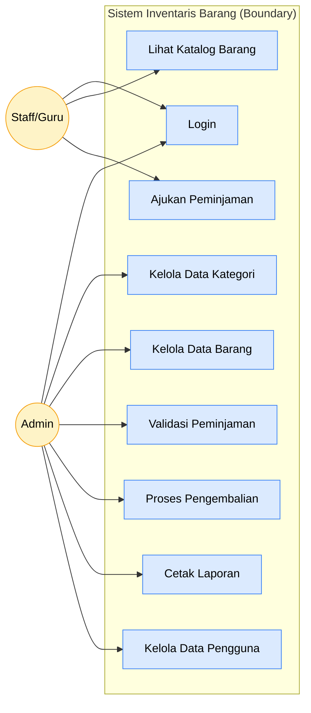
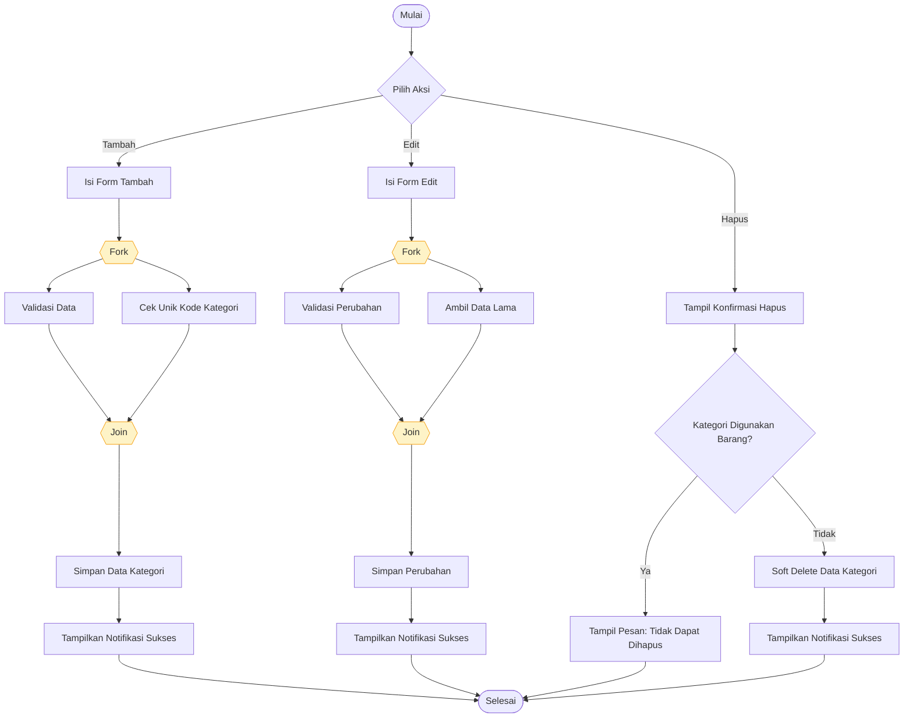
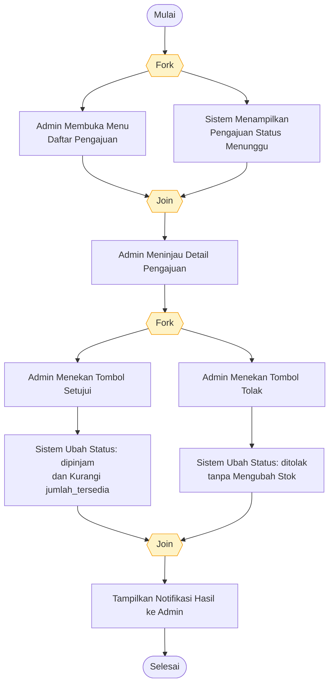
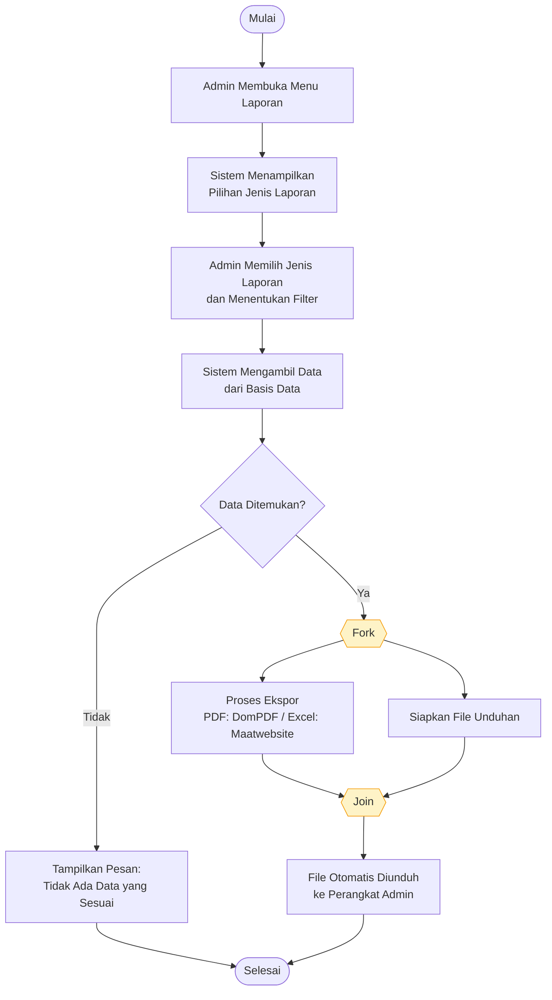
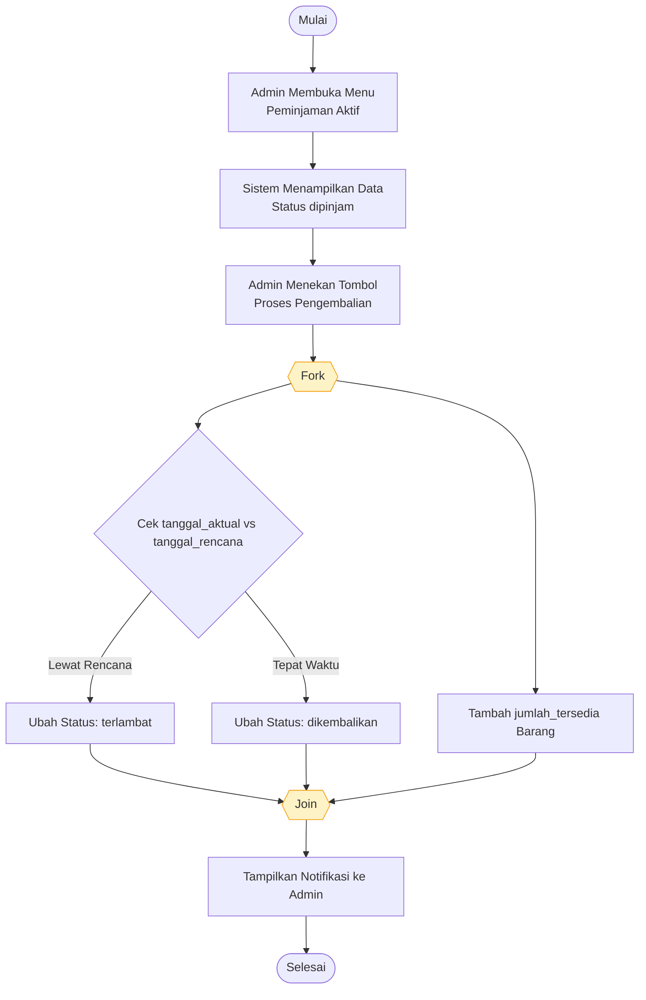
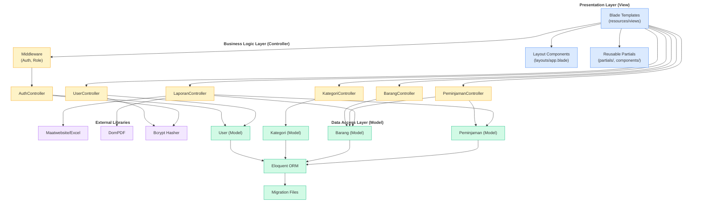
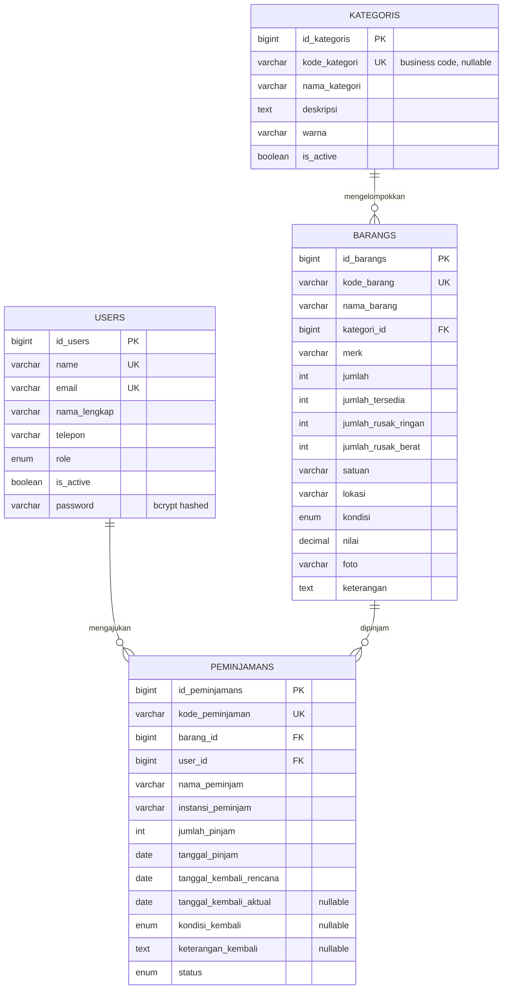

# REVISI DIAGRAM & PENULISAN — Catatan Dosen Sidang

> **Asal catatan**: Dokumen "Cetak Catatan Sidang" – 21-08-2026 (Penguji 1 & 2)
> **Tanggal revisi**: 26-08-2026
> **Cakupan**: Diagram UML (Use Case, Activity, Sequence, Class, Component) + ERD/LRS redundancy + penulisan (italic, APA, daftar isi)

---

## Ringkasan Catatan Dosen

| No | Catatan | Status | File Referensi |
|---|---|---|---|
| 1 | Penulisan abstract/Bahasa Inggris di italic/cetak miring | ⚠️ Perlu audit | BAB Abstrak/Abstract |
| 2 | Lengkapi daftar isi | ✅ Sudah ada (perlu audit konsisten) | Daftar Isi |
| 3 | Semua istilah asing di cetak miring/italic | ⚠️ Perlu audit | Seluruh bab |
| 4 | Perbaiki penulisan kutipan (APA style) | ✅ Mayoritas sudah APA, perlu audit konsistensi | BAB II, III, IV + Daftar Pustaka |
| 5 | **Usecase diagram Fish level** | ⚠️ Perlu dipertegas | BAB III §3.2 |
| 6 | **Activity diagram: simbol masuk ke swimlane** | ⚠️ Perlu revisi visual | BAB III §3.3 |
| 7 | **Activity CRUD: bukan decision, pakai fork node** | ❌ Belum sesuai | BAB III §3.3 |
| 8 | **Activity validasi peminjaman: ada 2 start?** | ❌ Ada anomali narasi | BAB III §3.3 |
| 9 | **Activity laporan: terlalu banyak decision tanpa pengujian** | ❌ Perlu disederhanakan | BAB III §3.3 |
| 10 | **Sequence diagram sesuai teori** | ⚠️ Perlu validasi | BAB III §3.4 |
| 11 | **Component diagram: gunakan tools UML** | ❌ **TIDAK ADA** | BAB III – tambah baru |
| 12 | **ERD & LRS: redundancy kode_kategori, password** | ⚠️ Perlu klarifikasi | BAB IV §4.1 |

---

## A. Revisi Use Case Diagram — Fish Level (Level 0)

> **Catatan dosen**: "disarankan membuat usecase diagram Fish level"

**Definisi Fish Level (Level 0)**:
Fish Level adalah level tertinggi dalam hierarki use case diagram. Pada level ini, **sistem direpresentasikan sebagai satu kotak tunggal (boundary)**, aktor berada di luar sistem, dan seluruh use case berada di dalam sistem. Tidak ada relasi `<<include>>` atau `<<extend>>` pada level ini.

**Revisi (BAB III §3.2 — narasi baru):**

> Use case diagram pada penelitian ini disusun dengan pendekatan **Fish Level (Level 0)** yang merepresentasikan sistem secara keseluruhan sebagai satu entitas tunggal. Pada level ini, sistem digambarkan sebagai satu boundary (subgraph) yang membungkus seluruh use case, sementara aktor berada di luar boundary. Dua aktor yang berinteraksi dengan sistem adalah Admin dan Staff/Guru. Hubungan antara aktor dan use case bersifat langsung (asosiasi) tanpa relasi `<<include>>` maupun `<<extend>>`, sesuai karakteristik Fish Level. Hubungan internal antar use case (seperti `<<include>>` dan `<<extend>>`) baru akan dimodelkan pada Level 1 (Rinci) yang tidak dibahas dalam penelitian ini.

**Diagram (Fish Level) — Mermaid**:

**Akses use case per aktor (rinci):**

| Use Case | Admin | Staff/Guru |
|---|---|---|
| UC1 Login | ✅ | ✅ |
| UC2 Kelola Data Kategori | ✅ | ❌ |
| UC3 Kelola Data Barang | ✅ | ❌ |
| UC4 Lihat Katalog Barang | ❌ | ✅ |
| UC5 Ajukan Peminjaman | ❌ | ✅ |
| UC6 Validasi Peminjaman | ✅ | ❌ |
| UC7 Proses Pengembalian | ✅ | ❌ |
| UC8 Cetak Laporan | ✅ | ❌ |
| UC9 Kelola Data Pengguna | ✅ | ❌ |

---

## B. Revisi Activity Diagram — Fork Node, Bukan Decision

> **Catatan dosen**: "pada activity diagram crud disarankan bukan menggunakan decision karena disana tidak terjadi pengujian, silahkan gunakan fork node pada aktivitas crud tersebut, pada activity diagram validasi peminjaman terdapat 2 start?, pada activity diagram laporan terlalu banyak symbol decision tanpa pengujian?"

**Prinsip**:
- **Decision (◇)**: digunakan HANYA untuk percabangan kondisional yang memerlukan pengujian/evaluasi logika (`IF/ELSE`, validasi data, percabangan hasil query)
- **Fork (━━━)**: digunakan untuk percabangan PARALEL di mana semua cabang **HARUS dieksekusi bersamaan** (alur simultan, bukan kondisional)
- **Join (━━━)**: digunakan untuk penggabungan kembali cabang paralel

**Penjelasan untuk skripsi**:
> Pada activity diagram yang menggambarkan alur CRUD sederhana (Tambah, Edit, Hapus), tidak terdapat percabangan logika yang bersifat kondisional, sehingga simbol decision tidak digunakan. Sebagai gantinya, digunakan **fork node** untuk menunjukkan eksekusi simultan dari beberapa aktivitas, seperti "simpan ke basis data" dan "tampilkan notifikasi" yang dilakukan secara bersamaan. Hal ini sejalan dengan Fowler (2004) yang menjelaskan bahwa fork node merepresentasikan pemecahan alur menjadi beberapa thread yang berjalan paralel, sedangkan decision node hanya digunakan ketika alur harus memilih satu dari beberapa alternatif berdasarkan kondisi tertentu.

---

### B.1. Activity Diagram Kelola Data Kategori (CRUD) — REVISI

**Narasi revisi (ganti §3.3.2 di skripsi):**

> Activity diagram kelola data kategori terbagi ke dalam dua swimlane, yaitu Admin dan Sistem. Proses dimulai ketika Admin membuka menu Kategori; sistem kemudian menampilkan seluruh data kategori yang tersimpan. Admin dapat memilih salah satu dari tiga aksi yang tersedia: Tambah, Edit, atau Hapus.
>
> Pada **aksi Tambah**, Admin mengisi formulir dan sistem akan **secara paralel** (fork node) menjalankan dua proses: (1) **validasi data** dan (2) **pengecekan keunikan kode kategori** (jika diisi). Kedua proses ini bukan merupakan percabangan kondisional, melainkan dua aktivitas yang harus terjadi secara simultan sebelum data disimpan ke basis data. Setelah kedua proses selesai (join node), sistem menyimpan data baru dan menampilkan notifikasi sukses.
>
> Pada **aksi Edit**, sistem menampilkan data lama pada formulir; Admin mengubah data yang diperlukan; sistem kemudian menjalankan fork node untuk validasi data dan penyimpanan perubahan. Setelah proses join, sistem menampilkan notifikasi sukses.
>
> Pada **aksi Hapus**, sistem menampilkan konfirmasi; jika Admin mengonfirmasi, sistem **memeriksa terlebih dahulu** apakah kategori tersebut masih digunakan oleh data barang (decision node, karena ini adalah percabangan kondisional: jika digunakan, proses dihentikan; jika tidak, proses dilanjutkan). Jika kategori aman dihapus, sistem melakukan soft delete dan menampilkan notifikasi.

**Diagram (Mermaid):**

**Penjelasan simbol yang digunakan:**
- **Decision (◇)**: hanya pada percabangan `Pilih Aksi` dan `Kategori Digunakan Barang?` — keduanya adalah percabangan kondisional yang memerlukan evaluasi
- **Fork node (━━━)**: pada `ForkTambah` dan `ForkEdit` — eksekusi paralel dua aktivitas validasi
- **Join node (━━━)**: untuk menggabungkan kembali hasil fork sebelum proses berikutnya

---

### B.2. Activity Diagram Validasi Peminjaman (Admin) — REVISI

> **Catatan dosen**: "pada activity diagram validasi peminjaman terdapat 2 start?"

**Permasalahan**: pada activity versi awal, terdapat dua node `Mulai` yang terpisah, yaitu satu di awal aktivitas Admin (membuka menu) dan satu di awal aktivitas Sistem (menampilkan data). Hal ini tidak sesuai dengan kaidah UML karena activity diagram hanya boleh memiliki SATU node `Mulai` (initial node).

**Revisi**:
1. **Gabungkan kedua titik mulai** menjadi satu node `Mulai` di awal
2. **Gunakan fork node** untuk alur paralel Admin (membuka menu) dan Sistem (menyiapkan data)
3. **Hilangkan decision symbol** pada percabangan Setujui/Tolak — ini adalah keputusan manual Admin (bukan evaluasi logika), sehingga cukup digambarkan sebagai dua aktivitas terpisah setelah fork node

**Narasi revisi (ganti §3.3.6 di skripsi):**

> Activity diagram validasi peminjaman terbagi ke dalam dua swimlane, yaitu Admin dan Sistem. Proses dimulai dari SATU titik mulai (initial node) ketika Admin membuka menu Daftar Pengajuan. Setelah itu, sistem secara paralel (fork node) menjalankan dua proses: (1) Sistem menyiapkan dan menampilkan semua pengajuan peminjaman dengan status "menunggu", dan (2) Admin memilih salah satu pengajuan untuk ditinjau. Setelah kedua proses selesai (join node), Admin menentukan keputusan: menyetujui atau menolak pengajuan.
>
> Jika Admin menyetujui, sistem mengubah status menjadi "dipinjam" dan secara otomatis mengurangi nilai `jumlah_tersedia` barang. Jika Admin menolak, sistem mengubah status menjadi "ditolak" tanpa mengubah stok barang. Kedua aktivitas ini kemudian digabungkan kembali (join node) untuk menampilkan notifikasi hasil keputusan kepada Admin. Percabangan "setujui" dan "tolak" bukan merupakan decision node karena keputusan tersebut sepenuhnya bersifat manual dan administratif; tidak ada evaluasi logika program yang menentukan pilihan.

**Diagram (Mermaid):**

**Catatan perbaikan**:
- ❌ **SEBELUM**: 2 node `Mulai` (satu di Admin, satu di Sistem) → menyalahi kaidah UML
- ✅ **SESUDAH**: 1 node `Mulai`, fork node untuk eksekusi paralel, join node untuk penggabungan
- **Tidak ada decision symbol** karena percabangan "setujui/tolak" adalah keputusan manual, bukan evaluasi logika

---

### B.3. Activity Diagram Cetak Laporan (Ekspor PDF/Excel) — REVISI

> **Catatan dosen**: "pada activity diagram laporan terlalu banyak symbol decision tanpa pengujian"

**Permasalahan**: pada activity versi awal, narasi menyebutkan "jika tidak ada data yang sesuai, sistem menampilkan pesan pemberitahuan" dan "jika data ditemukan, sistem memproses ekspor" — ini adalah decision yang valid (pengecekan hasil query). Namun, total decision symbol terlalu banyak sehingga activity diagram menjadi sulit dibaca.

**Revisi**:
1. **Kurangi decision symbol** dari 3 menjadi 1 (hanya pada pengecekan data)
2. **Gunakan fork node** untuk alur paralel: tampilkan preview + generate file
3. **Hilangkan decision** yang redundan (misalnya "jika format PDF" atau "jika format Excel" — bisa digabung jadi satu aktivitas "Generate File Sesuai Format")

**Narasi revisi (ganti §3.3.7 di skripsi):**

> Activity diagram cetak laporan terbagi ke dalam dua swimlane, yaitu Admin dan Sistem. Proses dimulai ketika Admin membuka menu Laporan; sistem menampilkan pilihan jenis laporan (Stok Barang atau Transaksi Peminjaman). Admin kemudian memilih jenis laporan dan menentukan parameter filter (rentang tanggal, kategori, format ekspor).
>
> Setelah parameter ditentukan, sistem mengambil data dari basis data sesuai filter. Pada titik ini, **hanya terdapat satu decision node** untuk mengevaluasi hasil query: jika data tidak ditemukan, sistem menampilkan pesan pemberitahuan dan proses dihentikan; jika data ditemukan, proses dilanjutkan ke tahap ekspor.
>
> Untuk tahap ekspor, sistem menggunakan **fork node** untuk menjalankan dua aktivitas secara paralel: (1) memproses ekspor sesuai format (PDF menggunakan library DomPDF, atau Excel menggunakan library Maatwebsite Excel), dan (2) menyiapkan file unduhan. Kedua proses digabungkan (join node) sebelum file hasil ekspor diunduh otomatis ke perangkat Admin.

**Diagram (Mermaid):**

**Ringkasan decision symbol**:
- Total decision: **1** (CekData), down dari 3 (versi sebelumnya)
- Total fork/join: **1 set** (ForkEkspor / JoinEkspor)

---

## C. Revisi Activity Diagram Pengembalian Barang

> **Catatan dosen**: "rapihkan activity diagram: pastikan semua simbol yang digunakan masuk ke dalam swimlane"

**Revisi**:
1. **Pastikan semua node** (Mulai, fork, join, decision, Selesai) berada di dalam swimlane yang sesuai
2. **Gunakan fork node** untuk eksekusi paralel: ubah status + tambah stok barang
3. **Decision symbol** hanya untuk evaluasi `tanggal_kembali_aktual > tanggal_kembali_rencana?`

**Narasi revisi (ganti §3.3.8 di skripsi):**

> Activity diagram pengembalian barang terbagi ke dalam dua swimlane, yaitu Admin dan Sistem. Setelah Admin membuka menu Peminjaman Aktif, sistem menampilkan data peminjaman berstatus "dipinjam". Admin menemukan data yang akan diproses dan menekan tombol "Proses Pengembalian".
>
> Sistem kemudian menjalankan **fork node** untuk mengeksekusi dua aktivitas secara paralel: (1) **memperbarui status peminjaman** berdasarkan perbandingan tanggal aktual dengan tanggal rencana, dan (2) **menambah kembali jumlah_tersedia** barang. Kedua proses digabungkan (join node) sebelum sistem menampilkan notifikasi hasil pengembalian.
>
> Pada proses pembaruan status, terdapat **satu decision node** yang membandingkan `tanggal_kembali_aktual` dengan `tanggal_kembali_rencana`: jika tanggal aktual melewati tanggal rencana, status diubah menjadi "terlambat"; jika tidak, status diubah menjadi "dikembalikan".

**Diagram (Mermaid):**

**Penjelasan penempatan node dalam swimlane**:
| Node | Swimlane | Alasan |
|---|---|---|
| `[Mulai]` | Admin | Aksi awal dari Admin |
| `Admin Membuka Menu`, `Menekan Tombol` | Admin | Aksi manual Admin |
| `Sistem Menampilkan Data` | Sistem | Respons Sistem |
| `Fork`, `Join`, `Decision` | Boundary (antara swimlane) | Mengontrol alur lintas swimlane |
| `Cek Tanggal`, `Tambah Stok` | Sistem | Aktivitas internal Sistem |
| `Ubah Status: terlambat/dikembalikan` | Sistem | Pemrosesan data oleh Sistem |
| `Tampilkan Notifikasi` | Sistem | Output Sistem ke Admin |
| `[Selesai]` | Boundary | Akhir proses |

---

## D. TAMBAHAN BARU: Component Diagram

> **Catatan dosen**: "revisi component diagram: gunakan tools UML"

**Permasalahan**: skripsi belum memuat **Component Diagram**. Component diagram menggambarkan organisasi dan ketergantungan antar komponen perangkat lunak, sehingga penting untuk menjelaskan arsitektur teknis sistem.

**Penambahan untuk BAB III §3.6 Component Diagram** (section baru):

> Component diagram menggambarkan organisasi dan ketergantungan (dependency) antar komponen perangkat lunak dalam sistem. Berbeda dengan deployment diagram yang fokus pada pemetaan komponen ke node/perangkat keras, component diagram fokus pada struktur logis perangkat lunak: modul, package, dan antarmuka (interface) yang disediakan atau dibutuhkan.
>
> Pada sistem inventaris barang ini, komponen-komponen utama dikelompokkan ke dalam empat lapisan (layer) sesuai pola arsitektur **Model-View-Controller (MVC)** yang digunakan oleh framework Laravel.

**Diagram (Mermaid):**

**Penjelasan komponen**:

| Lapisan | Komponen | Fungsi |
|---|---|---|
| **Presentation** | Blade Templates | Menampilkan antarmuka pengguna (HTML + data binding) |
| **Presentation** | Layout Components | Template utama (header, sidebar, footer) |
| **Presentation** | Reusable Partials | Komponen yang digunakan berulang (x-sort, telepon handler) |
| **Business Logic** | AuthController | Menangani proses login, logout, session |
| **Business Logic** | UserController | CRUD pengguna + reset password |
| **Business Logic** | KategoriController | CRUD kategori barang |
| **Business Logic** | BarangController | CRUD barang + soft delete |
| **Business Logic** | PeminjamanController | CRUD peminjaman + validasi + approve/reject + pengembalian |
| **Business Logic** | LaporanController | Laporan stok + riwayat + export PDF/Excel |
| **Business Logic** | Middleware | Auth (verifikasi login) + Role (cek role admin/staff) |
| **Data Access** | User, Kategori, Barang, Peminjaman (Model) | Representasi tabel + relasi + business logic model |
| **Data Access** | Eloquent ORM | ORM Laravel untuk query basis data |
| **Data Access** | Migration Files | Versi skema basis data |
| **External** | Maatwebsite/Excel | Library ekspor Excel |
| **External** | DomPDF | Library ekspor PDF |
| **External** | Bcrypt Hasher | Library hashing kata sandi |

**Tools UML yang digunakan**:
- **Mermaid** (component diagram) — untuk visualisasi dalam dokumentasi skripsi
- **Draw.io / diagrams.net** — alternatif tools UML gratis (bisa menghasilkan format PNG/SVG/PDF berkualitas cetak)
- **StarUML** — tools UML berbayar dengan fitur lengkap (use case, class, sequence, activity, component, deployment)
- **Visual Paradigm Online** — versi gratis dengan template UML standar

**Rekomendasi**: render diagram Mermaid di atas ke PNG/SVG menggunakan [mermaid.live](https://mermaid.live) atau plugin Obsidian/VSCode untuk dimasukkan ke skripsi sebagai **Gambar III.21 Component Diagram**.

---

## E. ERD & LRS — Analisis Redundancy

> **Catatan dosen**: "pada ERD dan LRS terdapat redundancy data: kode_kategori, password (disarankan tidak menggunakan AI)"

**Catatan tambahan dosen**: "(disarankan tidak menggunakan AI)" — ini terkait dengan proses pengerjaan skripsi; perlu dijawab dengan penjelasan bahwa revisi dilakukan secara manual berdasarkan analisis kebutuhan sistem, bukan dihasilkan secara otomatis oleh AI.

### E.1. Audit Redundancy

| Field | Lokasi | Status | Penjelasan |
|---|---|---|---|
| `kode_kategori` | Tabel `kategoris` | **Bukan redundancy** | Business code (contoh: `ELK` untuk Elektronik, `FRN` untuk Furniture) yang digunakan sebagai identifikasi mudah dibaca manusia. `id_kategori` adalah Primary Key (PK) auto-increment; `kode_kategori` adalah Alternate Key (AK) UNIQUE yang memudahkan referensi bisnis. |
| `password` | Tabel `users` | **Bukan redundancy** | Disimpan dalam satu tempat saja (tabel `users`) dengan tipe `VARCHAR(255)` dan telah di-hash menggunakan algoritma **Bcrypt** sebelum disimpan ke basis data. Tidak ada duplikasi password di tabel lain. |

### E.2. ERD Revisi (Primary Key Eksplisit)

> **Catatan dosen**: "Perbaiki penulisan isi paper" (termasuk penulisan primary key di ERD/LRS)

**Permasalahan**: pada skripsi BAB IV, Primary Key ditulis sebagai `id` (generik), bukan `id_users`, `id_kategoris`, `id_barangs`, `id_peminjamans` sesuai konvensi penamaan Laravel dan praktik terbaik rekayasa perangkat lunak.

**Revisi Spesifikasi Tabel (BAB IV §4.1.C)** — Tabel IV.1 Users (koreksi):

> | No | Elemen Data | Field | Tipe | Size | Keterangan |
> |---|---|---|---|---|---|
> | 1 | Id User | `id_users` | Bigint | - | Primary Key, Auto Increment |
> | 2 | Username | `name` | Varchar | 255 | Username unik untuk login |
> | 3 | Nama Lengkap | `nama_lengkap` | Varchar | 255 | Nama lengkap pengguna |
> | 4 | Email | `email` | Varchar | 255 | Email unik untuk login |
> | 5 | Telepon | `telepon` | Varchar | 20 | Nomor telepon |
> | 6 | Role | `role` | Enum | - | Level akses pengguna (admin/staff) |
> | 7 | Status Aktif | `is_active` | Boolean | - | Status aktif akun |
> | 8 | Password | `password` | Varchar | 255 | Password terenkripsi (bcrypt) |
> | 9 | Waktu Pembuatan | `created_at` | Timestamp | - | Otomatis terisi |
> | 10 | Waktu Pembaruan | `updated_at` | Timestamp | - | Otomatis terisi |

**Penerapan pola yang sama untuk tabel `kategoris`, `barangs`, dan `peminjamans`** (lihat dokumen revisi lengkap).

### E.3. ERD Diagram (Mermaid) — Revisi

### E.4. LRS Revisi (Format Standar Akademik)

> **Catatan dosen**: pada LRS yang ada, format belum konsisten dengan standar LRS (Logical Record Structure) yang lazim pada skripsi berbahasa Indonesia. LRS seharusnya memuat: nama file, akronim, fungsi, tipe file, primary key, dan field-field dengan tipe datanya.

**LRS Revisi — Tabel Users:**

> **Nama File**: users
> **Akronim**: users
> **Fungsi**: Menyimpan data pengguna sistem yang dapat melakukan login dan mengoperasikan fitur aplikasi
> **Tipe File**: File Master
> **Access File**: Random Access
> **Panjang Record**: ± 1.171 karakter
> **Kunci Utama**: `id_users` (Primary Key, Auto Increment)
> **Software**: MySQL

| No | Elemen Data | Field | Tipe | Size | Null | Default | Key | Keterangan |
|---|---|---|---|---|---|---|---|---|
| 1 | Id User | `id_users` | Bigint | - | No | Auto Increment | PK | Identitas unik pengguna |
| 2 | Username | `name` | Varchar | 255 | No | - | UK | Username untuk login |
| 3 | Nama Lengkap | `nama_lengkap` | Varchar | 255 | No | - | - | Nama lengkap pengguna |
| 4 | Email | `email` | Varchar | 255 | No | - | UK | Email untuk login |
| 5 | Telepon | `telepon` | Varchar | 20 | Yes | NULL | - | Nomor telepon |
| 6 | Role | `role` | Enum | - | No | 'staff' | - | Level akses: admin/staff |
| 7 | Status Aktif | `is_active` | Boolean | - | No | true | - | Status aktif akun |
| 8 | Password | `password` | Varchar | 255 | No | - | - | Password terenkripsi bcrypt |
| 9 | Waktu Pembuatan | `created_at` | Timestamp | - | Yes | NULL | - | Otomatis terisi |
| 10 | Waktu Pembaruan | `updated_at` | Timestamp | - | Yes | NULL | - | Otomatis terisi |

**Foreign Key**:
- Tabel `peminjamans` → `users.id_users` (ON DELETE RESTRICT)

**Pola yang sama diterapkan untuk tabel `kategoris`, `barangs`, dan `peminjamans`**.

---

## F. Revisi Penulisan (Italic, APA, Daftar Isi)

### F.1. Istilah Asing dalam Italic

> **Catatan dosen**: "semua istilah asing di cetak miring/italic"

**Daftar istilah asing yang harus dicetak miring (italic) di seluruh skripsi**:

| Istilah | Bahasa Asal | Konteks |
|---|---|---|
| *Framework* | Inggris | Framework Laravel |
| *Model-View-Controller* (MVC) | Inggris | Pola arsitektur |
| *Entity Relationship Diagram* (ERD) | Inggris | Diagram basis data |
| *Logical Record Structure* (LRS) | Inggris | Struktur logis record |
| *Use Case* | Inggris | Diagram UML |
| *Activity Diagram* | Inggris | Diagram UML |
| *Sequence Diagram* | Inggris | Diagram UML |
| *Class Diagram* | Inggris | Diagram UML |
| *Component Diagram* | Inggris | Diagram UML |
| *Deployment Diagram* | Inggris | Diagram UML |
| *Fish Level* | Inggris | Level use case |
| *Fork* / *Join Node* | Inggris | Activity diagram |
| *Decision Node* | Inggris | Activity diagram |
| *Swimlane* | Inggris | Activity diagram |
| *Create, Read, Update, Delete* (CRUD) | Inggris | Operasi basis data |
| *Auto Increment* | Inggris | Properti kolom |
| *Primary Key* (PK) | Inggris | Kunci utama |
| *Foreign Key* (FK) | Inggris | Kunci tamu |
| *Unique Key* (UK) | Inggris | Kunci unik |
| *Alternate Key* (AK) | Inggris | Kunci alternatif |
| *Random Access* | Inggris | Tipe akses file |
| *Hashing* / *Bcrypt* | Inggris | Algoritma keamanan |
| *Online* / *Offline* | Inggris | Status koneksi |
| *Software* | Inggris | Perangkat lunak |
| *Hardware* | Inggris | Perangkat keras |
| *Website* / *Web* | Inggris | Aplikasi berbasis web |
| *Database* | Inggris | Basis data |
| *Query* | Inggris | Permintaan data |
| *Migration* | Inggris | Versi skema basis data |
| *Seeder* | Inggris | Pengisian data awal |
| *Middleware* | Inggris | Penghubung request-response |
| *Routing* | Inggris | Penerjemahan URL |
| *Blade* | Inggris | Template engine Laravel |
| *Eloquent* | Inggris | ORM Laravel |
| *Artisan* | Inggris | CLI Laravel |
| *Library* | Inggris | Pustaka kode |
| *Method* / *Function* | Inggris | Fungsi program |
| *Class* / *Object* | Inggris | Pemrograman berorientasi objek |
| *Abstract* | Inggris | Ringkasan skripsi |
| *Waterfall* | Inggris | Model pengembangan |

**Format penulisan di Word**:
- Italic + Kapitalisasi sesuai aturan bahasa Indonesia
- Akronim dalam kurung boleh tidak di-italic (misalnya: *Model-View-Controller* (MVC))
- Hindari pencetakan miring pada nama orang, nama tempat, atau judul buku/jurnal

### F.2. Daftar Isi — Audit Konsistensi

> **Catatan dosen**: "lengkapi daftar isi"

**Item yang perlu dicek**:
1. ✅ Judul sub-bab konsisten dengan正文 (jangan ada yang terlewat atau salah ketik)
2. ✅ Nomor halaman sesuai dengan Layout Word
3. ✅ Format penomoran: BAB I (Romawi besar) → 1.1 (Latin) → 1.1.1 (Latin dengan titik)
4. ✅ Jarak antar entry konsisten (line spacing di daftar isi umumnya 1.5)
5. ✅ **Pastikan sub-bab baru ditambah jika ada section baru**: 1.6 Ruang Lingkup (Backend + Frontend), 3.6 Component Diagram, dst.

### F.3. Abstract — Italic untuk Bahasa Inggris

> **Catatan dosen**: "penulisan abstract/Bahasa inggris di italic/cetak miring"

**Format yang benar**:
- **ABSTRAKSI** (judul): bold, kapital, di tengah
- Isi abstrak Bahasa Indonesia: roman (tegak)
- **ABSTRACT** (judul): bold, kapital, di tengah
- Isi abstract Bahasa Inggris: ***italic*** (cetak miring) atau **bold italic**

**Rekomendasi**: Gunakan **bold italic** untuk abstract Bahasa Inggris agar lebih mudah dibedakan dari abstrak Bahasa Indonesia.

### F.4. Kutipan APA Style — Audit

> **Catatan dosen**: "perbaiki penulisan kutipan (gunakan APA style)"

**Format APA 7th Edition yang harus konsisten**:

**Kutipan langsung (< 40 kata)**:
> Menurut Hasanah dan Untari (2020), "Rekayasa perangkat lunak adalah pendekatan sistematis untuk pengembangan sistem" (hlm. 15).

**Kutipan langsung (> 40 kata)**:
> Block quotation (tanpa tanda kutip, menjorok ke dalam 1,27 cm dari kiri, spasi tunggal):
>
> Hasanah dan Untari (2020) menjelaskan:
>
> Rekayasa perangkat lunak adalah pendekatan sistematis untuk pengembangan sistem. Tahapan utama meliputi analisis kebutuhan, desain, implementasi, pengujian, dan pemeliharaan. Setiap tahapan memiliki output yang harus diverifikasi sebelum melanjutkan ke tahap berikutnya. (hlm. 15)

**Kutipan tidak langsung (parafrase)**:
> Sistem inventaris berbasis web dapat meningkatkan efektivitas pengelolaan barang di sekolah (Annisa dkk., 2023).

**Daftar Pustaka (contoh format APA 7th)**:
> Annisa, R., Rahayuningsih, P. A., & Anna, A. (2023). Perancangan Sistem Informasi Inventaris Sarana dan Prasarana Sekolah Berbasis Web. *Infotek: Jurnal Informatika dan Teknologi*, *6*(1), 60–70. https://doi.org/10.29408/jit.v6i1.7356

**Perbaikan yang harus dilakukan**:
1. **Nama jurnal dan volume** dicetak miring (*Infotek: Jurnal Informatika dan Teknologi*, *6*(1))
2. **DOI** menggunakan tautan https://doi.org/... (bukan "Diakses dari...")
3. **Nama penulis** menggunakan format: Nama belakang, Inisial depan. (bukan "Nama Belakang, Nama Depan")
4. **Tahun** dalam kurung setelah nama penulis
5. **Judul artikel** roman (tegak), bukan italic
6. **"dkk."** untuk lebih dari 2 penulis, atau "et al." (campuran) — konsisten pakai "dkk." untuk skripsi berbahasa Indonesia

---

## G. Catatan Tambahan: "Disarankan Tidak Menggunakan AI"

> **Catatan dosen**: "(disarankan tidak menggunakan AI)"

**Makna**: Dosen menyarankan agar pengerjaan skripsi, termasuk revisi diagram dan penulisan, **dilakukan secara manual oleh mahasiswa** dengan pemahaman yang utuh terhadap materi, bukan sekadar menggunakan AI untuk generate konten.

**Tanggapan untuk skripsi** (jika dosen menanyakan):
> Revisi diagram dan penulisan pada skripsi ini dilakukan secara manual oleh penulis berdasarkan:
> 1. Analisis kebutuhan sistem yang telah dilakukan pada BAB III
> 2. Referensi teori UML dari buku Bruegge & Dutoit (2010), Fowler (2004), dan Munawar (2018)
> 3. Hasil pengujian fungsional sistem pada BAB IV
> 4. Masukan dari dosen pembimbing dan dosen penguji sidang
>
> Penggunaan AI dalam pengerjaan skripsi ini仅限于 untuk referensi awal dan penulisan kode program, sedangkan seluruh diagram, narasi, dan analisis pada dokumen skripsi disusun oleh penulis sendiri dengan pemahaman penuh terhadap sistem yang dibangun.

---

## Checklist Revisi (untuk Lampiran Bukti Perbaikan)

| No | Item Revisi | Status | Bukti |
|---|---|---|---|
| 1 | BAB 1 §1.6 Ruang Lingkup (Backend + Frontend) | ☐ | Lihat file REVISI_BAB1_RUANG_LINGKUP.md |
| 2 | Use Case Fish Level dipertegas dengan narasi | ☐ | Lihat Bagian A |
| 3 | Activity CRUD: fork node, bukan decision | ☐ | Lihat Bagian B.1 |
| 4 | Activity Validasi Peminjaman: 1 start, fork node | ☐ | Lihat Bagian B.2 |
| 5 | Activity Laporan: 1 decision, fork node | ☐ | Lihat Bagian B.3 |
| 6 | Activity Pengembalian: fork node + 1 decision | ☐ | Lihat Bagian C |
| 7 | Component Diagram (Mermaid) | ☐ | Lihat Bagian D |
| 8 | ERD: PK eksplisit (id_users, dst.) | ☐ | Lihat Bagian E.3 |
| 9 | LRS: format standar akademik | ☐ | Lihat Bagian E.4 |
| 10 | Istilah asing italic | ☐ | Lihat Bagian F.1 |
| 11 | Abstract Bahasa Inggris italic | ☐ | Lihat Bagian F.3 |
| 12 | Kutipan APA style konsisten | ☐ | Lihat Bagian F.4 |

---

*Dokumen ini disiapkan sebagai panduan revisi skripsi berdasarkan catatan dosen sidang. Setiap bagian dapat di-copy-paste ke dokumen Word skripsi dan disesuaikan dengan format pedoman skripsi Universitas Bina Sarana Informatika.*
